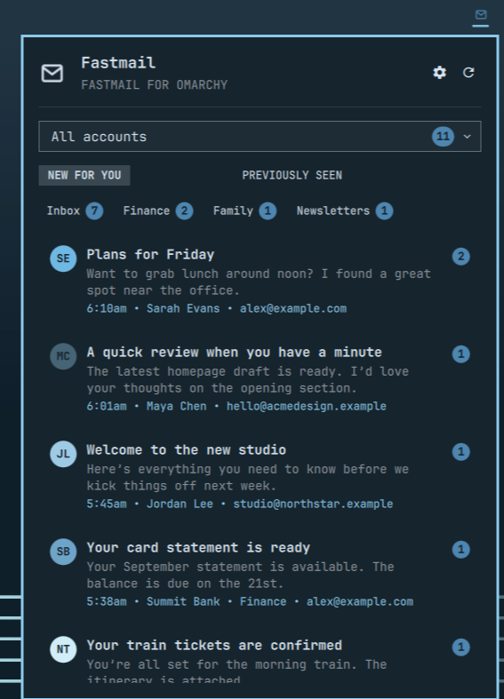
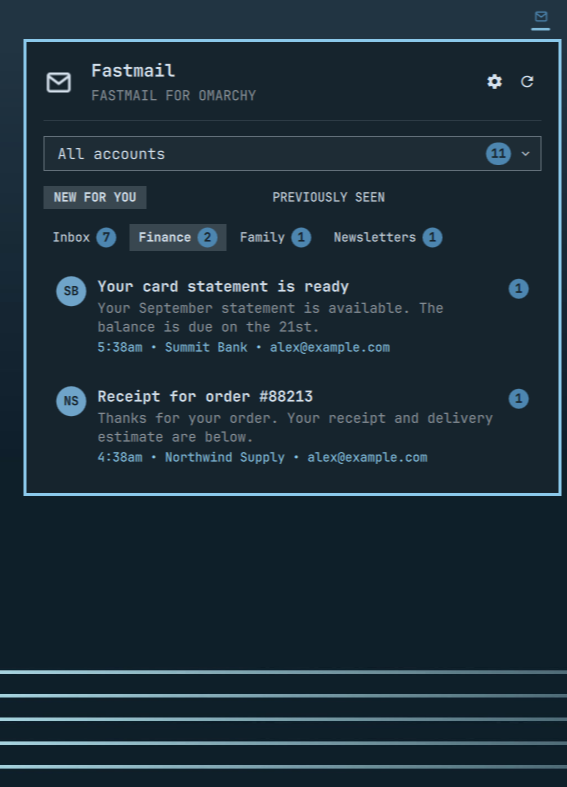
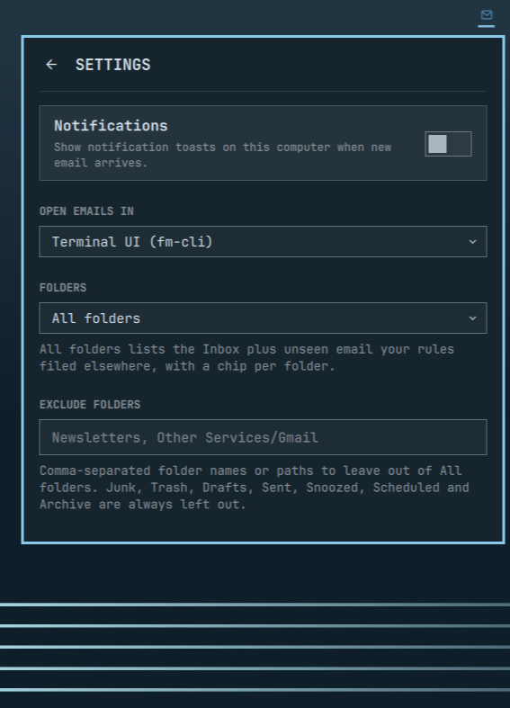
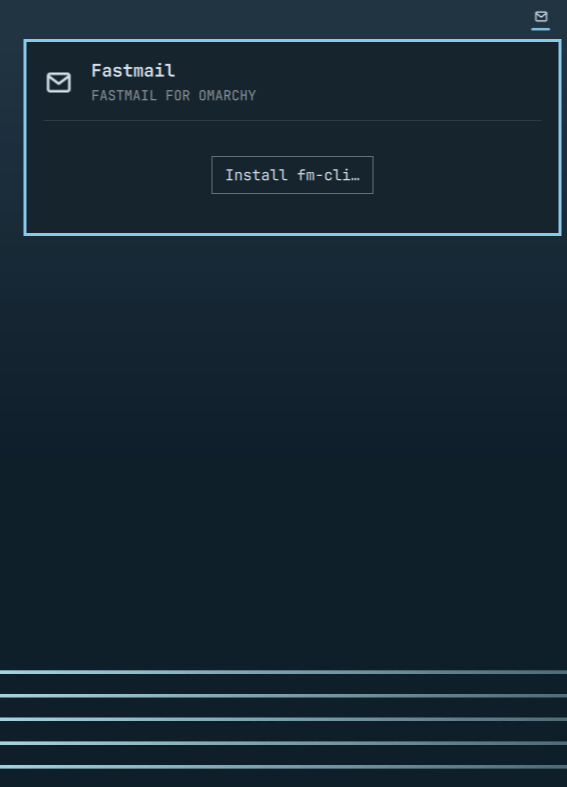

# Fastmail for Omarchy

Your Fastmail mail in the Omarchy bar: an envelope that changes color when
there is unread mail, and a panel that lists it, live, including the messages
your Fastmail rules filed into other folders. Powered by
[fm-cli](https://github.com/ninepointlabs/fm-cli), a small Go command-line
client for Fastmail, which the panel installs for you.

<table>
<tr>
<td width="50%"></td>
<td width="50%"></td>
</tr>
<tr>
<td width="50%"></td>
<td width="50%"></td>
</tr>
</table>

## What it does

- **Shows unread mail** from your Inbox and, by default, from every other
  folder your rules file mail into. A chip strip under the tabs names each
  folder that has unread mail, with a count. Click a chip to see only that
  folder, click it again to see everything.
- **Updates live.** The panel follows your mailbox over Fastmail's push
  connection, so a message you read on your phone leaves the panel within a
  second or two. Every ten minutes it re-reads everything as a fallback.
  Right-click or middle-click the envelope to refresh now.
- **Opens the email where you want it**: in a Fastmail window, in the fm-cli
  terminal app, or in your browser. Each lands on the message itself.
- **Marks mail as seen** when you open it, or when you click the count badge.
- **Notifies you** of new mail, one toast per burst, replacing the previous
  one rather than stacking. Off by default. Omarchy's notification silencing
  applies. A click on the toast opens the message wherever you chose above.
- **Handles several accounts**, with a dropdown that shows the unread count
  per account.

## Requirements

- Omarchy with Quickshell plugin support.
- A Fastmail account.
- fm-cli 0.3.0 or newer. The panel installs it if it is missing.

## Install

```bash
omarchy plugin add https://github.com/ninepointlabs/omarchy-fastmail.git --enable
```

Click the envelope in the bar. The panel checks for fm-cli:

1. **Install fm-cli…** appears when it is missing. It opens a floating
   terminal that installs the pinned release through mise, then goes straight
   into sign-in.
2. **Sign in to Fastmail…** appears when fm-cli is there but signed out. It
   opens Fastmail's consent page in your browser. Approve fm-cli there, and the
   terminal window closes on its own. Nothing to copy or paste. The
   authorization is listed under *Settings → Privacy & Security → Connected
   apps* in Fastmail, where you can revoke it at any time.

Prefer an API token? Run `fm-cli auth login --token` in a terminal first, and
the panel picks the sign-in up. Only one setup runs at a time; a second click
while one is in progress is refused rather than opening a second browser
login.

## Folders

Fastmail rules run on the server, so filed mail never touches the Inbox. The
plugin reads what fm-cli calls the *all* view: the newest Inbox threads plus
every unseen thread in every other folder.

- **Folders** in the settings: *All folders* (default) or *Inbox only*.
- **Exclude folders**: a comma-separated list of folder names or paths, such as
  `Newsletters, Other Services/Gmail`, to leave out. Excluding a parent folder
  leaves out its subfolders too. Up to 32 entries.
- Junk, Trash, Drafts, Sent, Snoozed, Scheduled and Archive are always left
  out, from the list and from notifications.
- A message's folder shows in its row, and the bar count covers every folder
  that is in. The *Previously seen* tab shows Inbox mail only.
- The chip selection is shared across monitors, like the account. Press `F`
  to cycle through the chips.

Both settings can also be set from a terminal:

```bash
omarchy bar set ninepointlabs.fastmail folders inbox --json
omarchy bar set ninepointlabs.fastmail excludeFolders "Newsletters, Other Services/Gmail" --json
```

## Where emails open

Click the cog and pick **Open emails in**:

- **Web app window** — Fastmail in its own Omarchy web-app window, on the
  message.
- **Terminal UI (fm-cli)** — the fm-cli terminal app, opened on the thread.
  A running fm-cli TUI jumps to it instead of a second one starting.
- **Browser** — your default browser, on the message.

The same choice decides what a click on a notification opens. A grouped
notification, several new emails in one burst, opens the Inbox.

## Keys

With the panel open:

| Key | Action |
|---|---|
| `↑` `↓` | Move through emails |
| `←` `→` | Cycle accounts |
| `Enter` | Open the selected email |
| `F` | Cycle the folder chips: every folder, then each chip in turn |
| `U` | Show new email |
| `P` | Show previously seen email |
| `N` | Toggle notifications |
| `R` | Refresh |
| `Esc` | Close settings, then the panel |
| `Tab` `Shift+Tab` | Switch to the next or previous bar panel |

## Notifications

Off by default. Turn them on with the switch in the settings, or with
`omarchy bar set ninepointlabs.fastmail notify true --json`. Each toast
identifies as **Fastmail** with the freedesktop `mail-unread` icon, so
Omarchy's notification silencing (SUPER+CTRL+comma) mutes it like any other
app. One new thread shows the subject and the first line; a burst shows
`N new in Inbox`, or `N new in 2 folders`, and the first few senders. Which
folders toast follows the **Folders** setting.

## Security

The plugin never talks to Fastmail itself: fm-cli does, and the plugin runs it
as a child process with its output size and run time capped. Everything
Fastmail sends — subjects, senders, folder names, ids — is treated as
untrusted:

- All text is shown as plain text, never rendered as HTML, and control,
  bidirectional-override and zero-width characters are stripped, so a subject
  cannot disguise itself or drive the terminal.
- Ids only reach a command line after matching the JMAP id alphabet, since
  one Omarchy launcher on the click path evaluates its arguments.
- Links only ever open `https://app.fastmail.com`. Anything else falls back to
  the Inbox.
- Notification clicks are handed to Omarchy as separate arguments, never as a
  shell string.
- The install command pins the fm-cli release this plugin was tested with; it
  is not "latest".
- The long-lived `fm-cli watch` is output- and event-rate-bounded and runs
  under `setpriv --pdeathsig TERM`, so it ends with the shell that started it.

For reviewers, this is everything the plugin executes:

```text
fm-cli --version; fm-cli auth status --json                   (probe)
fm-cli account list --json
fm-cli box view all|inbox --account all --limit 50 --json [--exclude <folder>]...
fm-cli --account all watch --events added,updated,deleted,new,resync
fm-cli seen <thread-id> [--account <id>] --json
fm-cli tui --thread <id> [--email <id>] --remote               (hand-off to a running TUI)
omarchy-launch-or-focus com.ninepointlabs.fm-cli '<quoted omarchy-launch-tui … fm-cli tui …>'
omarchy-launch-webapp <url> | xdg-open <url>
omarchy-notification-send … --exec <one of the three above, as argv>
omarchy-mise-install github:ninepointlabs/fm-cli@0.3.0 fm-cli && fm-cli setup --silent-success
                                                               (in a floating terminal, on your click)
flock -n <lock under $XDG_RUNTIME_DIR>; wl-copy               (setup lock; copying the setup command)
```

It writes only its own entry in `~/.config/omarchy/shell.json` and a lock
directory under `$XDG_RUNTIME_DIR`. Credentials live in your keyring, managed
by fm-cli; the plugin never sees them. Email data is held in memory only.

## Demo and tests

Run the current checkout against fictional accounts and mail, on an empty
workspace, with the shell restored on exit:

```bash
./demo/run                       # interactive; Ctrl+C restores everything
./demo/run --screenshot          # capture the bar and open panel, then exit
./demo/run --screenshot --folder Pfin1      # with the Finance chip selected
./demo/run --screenshot --settings          # the settings side
./demo/run --screenshot --state missing     # the first-run install prompt
```

The screenshots above come from those commands; `demo/bin/fm-cli` is a small
Python fake of the CLI that never contacts Fastmail. Tests:

```bash
./tests/run      # node tests for the model and demo, QML tests for the service
```

## Updating and removal

```bash
omarchy plugin update ninepointlabs.fastmail --yes
omarchy plugin remove ninepointlabs.fastmail --yes
```

Removal unloads the plugin and deletes its checkout. fm-cli, its keyring
credentials, and the plugin's saved settings in `shell.json` stay. Sign out
with `fm-cli auth logout`; remove fm-cli itself with
`mise uninstall github:ninepointlabs/fm-cli`.

## Credits

Adapted from 37signals' [HEY plugin for Omarchy](https://github.com/basecamp/omarchy-hey-plugin)
(MIT, Copyright (c) 2026 37signals LLC): the service, panel, bounded process
wrapper, demo harness and test suite descend from that project. The plain-text
dropdown descends from Omarchy's own `Dropdown.qml`. Full attributions are in
[THIRD_PARTY_NOTICES.md](THIRD_PARTY_NOTICES.md).

Fastmail is a trademark of Fastmail Pty Ltd. This plugin is not affiliated
with or endorsed by Fastmail, and the envelope icon is its own, not Fastmail's
mark.

## License

MIT. See [LICENSE](LICENSE).
